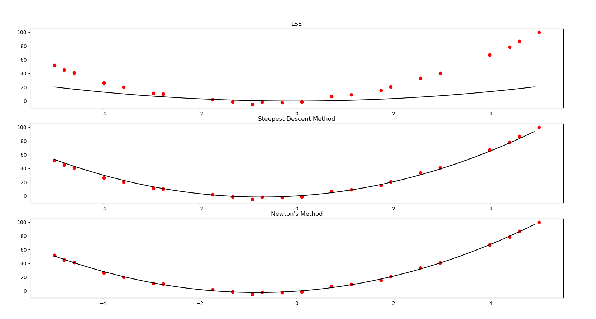

### The NYCU Machine Learning course homework 1

**使用語言**
* pyhton 3.11 (the previous version may be OK)

**需求套件**
* numpy 
* matplotlib

**執行指令**
* data points file 可放在此資料夾，輸入檔案路徑打檔名即可，執行以下指令
```
python main.py
```
* 接著依序輸入: data points file的路徑, n 跟 lambda

```
Please enter file path:
testfile.txt (my input)
Please enter n:
3 (my input)
Please enter lambda:
10000 (my input)
```

**一些討論**
* 對於 steepest descent，目前觀察 n 如果越大，learning rate 不夠小，容易導致無法收斂，且程式可能算出 overflow 的值而沒有結果。

* 目前統一 `learning rate = 0.0000005` 且迭代次數 `epochs = 10000`，限制迭代次數避免可能程式無法收斂停不下來，但會喪失一些精確度。

* 在上述參數下，程式到 `n = 5` 都能得出 steepest descent 的結果，`n > 5` 之後會 overflow。

**執行結果**
* **n = 3, lambda = 10000**

```
LSE:
Fitting line: 0.834533X^2 - 0.093148X^1 - 0.046951
Total error: 22649.738493

Steepest Descent Method:
Fitting line: 2.993185X^2 - 4.377270X^1 - 0.137197
Total error: 90.476554

Newton's Method:
Fitting line: 3.023853X^2 - 4.906190X^1 + 0.231402
Total error: 26.559959
```

